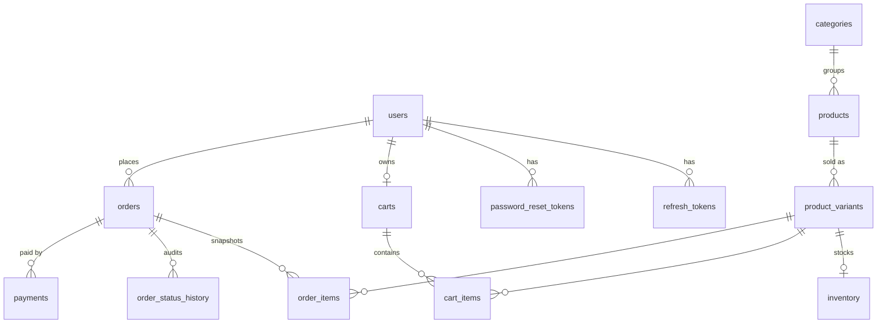

# TechStore

[](https://github.com/FernandaSpineli/techstore/actions/workflows/ci.yml)

E-commerce backend for electronics and accessories, written in Go. It covers
accounts, a searchable catalog with variants and stock, carts, orders with
stock reservation, Stripe Checkout with signed webhooks, and an embedded demo
storefront that shows every API call it makes.

**Stack:** Go 1.27 (stdlib `net/http`, `log/slog`) · PostgreSQL 18 (pgx,
hand-written SQL, goose migrations) · Redis 8 · Stripe · Docker ·
Testcontainers · GitHub Actions

## What's worth looking at

- **No overselling, even under load.** Stock is reserved inside the order
  transaction, with rows locked in a fixed order (so orders don't deadlock)
  and `CHECK` constraints as a backstop. Tests race 8 customers for 3 units,
  and 16 orders that share variants.
- **Payments that can't be faked or double-applied.** Only a signed Stripe
  webhook marks an order paid. Events are deduplicated in the same
  transaction as their effects, amounts are verified, and delayed methods
  (boleto) and late or double payments are handled. See
  [ADR 003](docs/decisions/003-payments.md).
- **Redis only where it earns its place:** shared rate limits, a versioned
  catalog cache, and `Idempotency-Key` on order creation. Each one keeps
  working (fails open) if Redis is down. See [ADR 002](docs/decisions/002-redis.md).
- **Auth done carefully:** bcrypt, pinned-algorithm JWTs, rotating refresh
  tokens with reuse detection, and password reset without account
  enumeration.
- **Logs you can query and share.** Structured JSON with request and user
  IDs, over 60 named business events, and a test that audits a full
  purchase's logs for leaked secrets.
- **Tests against real infrastructure:** 133 tests (233 with subtests) and
  89% statement coverage. They run on PostgreSQL, Redis and Mailpit in
  containers, plus a fake Stripe API server.

## Quick start

Requires Docker with Compose v2.

```bash
cp .env.example .env        # then set JWT_SECRET (openssl rand -base64 48)
make up                     # postgres, redis, mailpit, migrations, api
make seed                   # sample catalog
open http://localhost:8080  # demo storefront
```

To try the admin endpoints, create an account (in the storefront or with
`POST /api/v1/auth/register`) and promote it:

```bash
make admin EMAIL=you@example.com
```

Password-reset emails land in Mailpit at <http://localhost:8025>.

If ports 8080, 5432, 6379 or 8025 are taken, change `HTTP_PORT`,
`POSTGRES_PORT`, `REDIS_PORT` or `MAILPIT_UI_PORT` in `.env`.

### Payments (Stripe test mode)

Payments are optional locally. Without keys, checkout answers
`503 PAYMENTS_UNAVAILABLE` and everything else works.

1. Put a **test-mode** secret key in `.env`: `STRIPE_SECRET_KEY=sk_test_...`.
   Live keys are refused unless `APP_ENV=production`.
2. Start the Stripe CLI, which forwards webhooks to the API:
   ```bash
   docker compose --profile stripe up -d
   docker compose logs stripe   # "Your webhook signing secret is whsec_..."
   ```
3. Copy that `whsec_...` value into `STRIPE_WEBHOOK_SECRET` in `.env`, then
   restart the API: `docker compose up -d api`.
4. In the storefront, place an order and choose **Pay with Stripe**. Use card
   `4242 4242 4242 4242`, any future date and any CVC. The order turns
   `paid` once the signed webhook arrives.

The automated tests never call Stripe: they use a fake gateway and webhooks
signed locally with the real verification code.

## Configuration

All configuration comes from the environment. The app refuses to start, and
lists every problem at once, when a value is invalid. See
[.env.example](.env.example).

| Variable | Default | Purpose |
| --- | --- | --- |
| `APP_ENV` | `development` | `development`, `test` or `production` |
| `HTTP_ADDR` | `:8080` | Listen address |
| `LOG_LEVEL` | `info` | `debug`, `info`, `warn`, `error` |
| `DATABASE_URL` | — (required) | PostgreSQL connection string |
| `REDIS_URL` | — (required) | Redis connection string |
| `JWT_SECRET` | — (required, ≥ 32 chars) | Signs access tokens |
| `ACCESS_TOKEN_TTL` / `REFRESH_TOKEN_TTL` | `15m` / `720h` | Token lifetimes |
| `PASSWORD_RESET_TTL` | `30m` | Reset link lifetime |
| `ORDER_RESERVATION_TTL` | `30m` | How long an unpaid order holds stock |
| `APP_BASE_URL` | `http://localhost:8080` | Used in emails and Stripe redirects |
| `RATE_LIMIT_AUTH_PER_MINUTE` / `RATE_LIMIT_API_PER_MINUTE` | `10` / `300` | Per-IP limits |
| `CATALOG_CACHE_TTL` | `60s` | Upper bound on catalog cache staleness |
| `CORS_ALLOWED_ORIGINS` | empty (off) | Comma-separated origins for external frontends |
| `STRIPE_SECRET_KEY` / `STRIPE_WEBHOOK_SECRET` | empty (payments off) | Required in production |
| `SMTP_ADDR`, `SMTP_USERNAME`, `SMTP_PASSWORD`, `MAIL_FROM` | Mailpit | Outgoing email |
| `SHUTDOWN_TIMEOUT` | `15s` | Graceful shutdown budget |

## API

All endpoints live under `/api/v1`. The full contract is in
[docs/openapi.yaml](docs/openapi.yaml) (OpenAPI 3.1, linted, and checked
against the router by a test).

| Area | Endpoints |
| --- | --- |
| Auth | `POST /auth/register` · `/auth/login` · `/auth/refresh` · `/auth/logout` · `/auth/password/forgot` · `/auth/password/reset` |
| Profile | `GET`/`PATCH /users/me` · `PUT /users/me/password` |
| Catalog | `GET /categories` · `GET /products?q=&category=&brand=&min_price=&max_price=&in_stock=&sort=&page=&per_page=` · `GET /products/{slug}` |
| Cart | `GET`/`DELETE /cart` · `POST /cart/items` · `PATCH`/`DELETE /cart/items/{variantId}` |
| Orders | `POST /orders` (`Idempotency-Key`) · `GET /orders` · `GET /orders/{id}` · `POST /orders/{id}/cancel` |
| Payments | `POST /orders/{id}/checkout` · `POST /payments/webhook` |
| Admin | categories, products, variants, stock (`/variants/{id}/inventory`), `/admin/products`, `/admin/orders`, `PATCH /admin/orders/{id}/status` |

Every error uses the same envelope:

```json
{
  "error": {
    "code": "INSUFFICIENT_STOCK",
    "message": "Not enough units in stock for some items",
    "details": [{ "variant_id": "…", "requested": 4, "available": 3 }],
    "request_id": "9b69a44c5000acbf81baf8dedce4f07a"
  }
}
```

Status codes follow their meaning: 400 malformed body, 401 unauthenticated,
403 wrong role, 404 not found (including other users' orders), 409 conflicts
with current state, 422 invalid fields, 429 rate limited, and 502/503 for
payment provider problems. Server errors never include internal details.

```bash
# Browse
curl 'localhost:8080/api/v1/products?q=iph&sort=price_asc'
# Sign in and order what's in the cart
TOKEN=$(curl -s -XPOST localhost:8080/api/v1/auth/login \
  -d '{"email":"you@example.com","password":"…"}' | jq -r .tokens.access_token)
curl -XPOST localhost:8080/api/v1/orders -H "Authorization: Bearer $TOKEN" \
  -H "Idempotency-Key: $(uuidgen)"
```

## Database



Migrations are in [migrations/](migrations) and embedded in the binary
(`api migrate up|down|status`; compose runs them before the API starts).
UUIDv7 keys, money as integer cents, and invariants enforced with `CHECK`,
unique and partial unique indexes. See
[ADR 001](docs/decisions/001-database.md).

## Development

| Command | What it does |
| --- | --- |
| `make test` | All tests with the race detector (needs Docker for Testcontainers) |
| `make test-unit` | Only tests that need no containers |
| `make cover` | HTML coverage report |
| `make lint` / `make fmt` | golangci-lint v2 / gofumpt + goimports, pinned and run in Docker |
| `make build` | Static binary in `bin/` |
| `make run` | Run on the host against the compose databases |
| `make up` / `make down` / `make logs` | Manage the compose stack |

### Tests

- **Unit:** the business rules on their own (state machine, cart totals,
  token validation, search query building, config).
- **Integration:** migrations up and down, schema constraints, Redis
  features, SMTP delivery to Mailpit, and the Stripe client against a fake
  API.
- **API:** the real router, wiring and middleware against PostgreSQL and
  Redis. They cover the auth matrix (401/403 on every protected route),
  failure paths (out of stock, invalid quantity, unknown product, declined
  payment, forged and duplicated webhooks) and concurrency races.

Each test gets its own database, cloned from a migrated template, so tests
are isolated and fast (about 15 s for the full suite on a laptop, once images are pulled).

### CI

[`.github/workflows/ci.yml`](.github/workflows/ci.yml) runs on every push and
pull request:

1. **lint:** `go mod tidy -diff` and golangci-lint.
2. **test:** `go vet` and the full test suite with `-race`, plus a coverage
   summary and artifact.
3. **security:** govulncheck, gitleaks over the full history, and hadolint.
4. **build:** the binary and the Docker image (BuildKit cache).

Dependabot keeps modules, actions and base images current.

## Documentation

- [Architecture](docs/architecture.md): modules, request lifecycle, order
  state machine, checkout sequence, concurrency strategy, logging events,
  security.
- Decisions:
  [001 database](docs/decisions/001-database.md) ·
  [002 Redis](docs/decisions/002-redis.md) ·
  [003 payments](docs/decisions/003-payments.md)
- [OpenAPI specification](docs/openapi.yaml)

## Known limitations

Refunds are manual (late and double payments are flagged in the logs).
Cancelling waits for an open Stripe session to close. The rate limiter keys
on the connection IP, so it needs forwarded-header support behind a proxy.
The account email can't be changed. Details are in
[architecture.md](docs/architecture.md#known-limitations).
