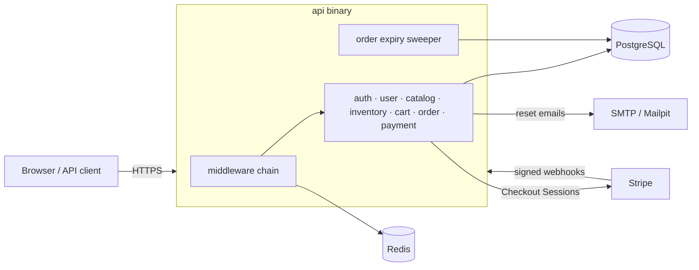
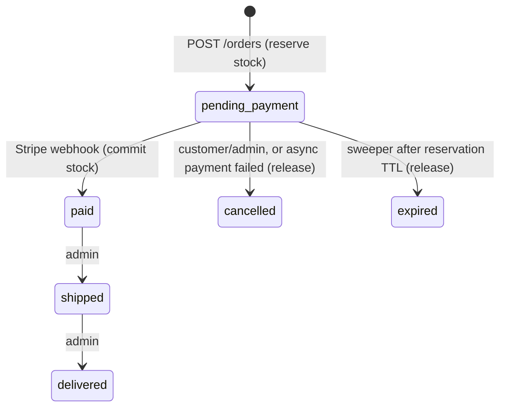
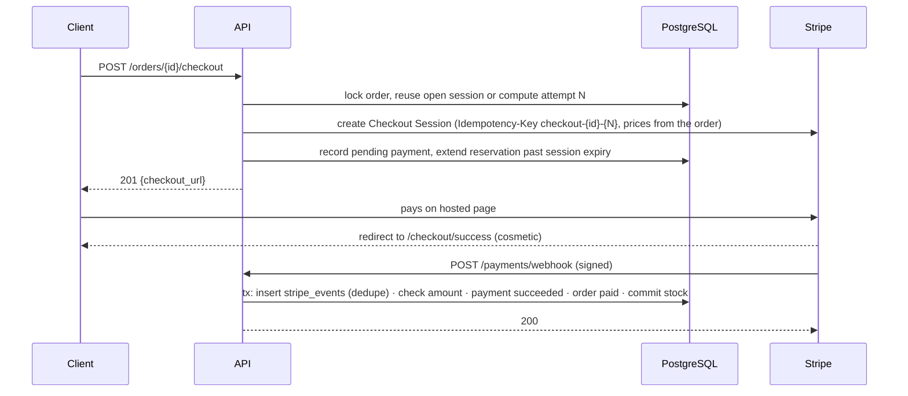

# Architecture

TechStore is a modular monolith: one Go binary that serves the REST API, the
demo storefront and a background job, backed by PostgreSQL (source of truth)
and Redis (protection and caching). Stripe takes payments; SMTP sends email.



## Package layout

```text
cmd/api/              entry point: config, wiring, graceful shutdown, CLI (migrate, user promote, seed-demo)
internal/
  app/                builds every module and lists every route (routes.go) with its middleware
  auth/               credentials, JWT access tokens, refresh-token rotation, password reset, auth middleware
  user/               the signed-in user's profile
  catalog/            categories, products, variants, search
  inventory/          stock levels; reserve / commit / release
  cart/               per-user cart
  order/              order creation, state machine, expiry sweeper
  payment/            Stripe Checkout and webhooks
  demo/               sample catalog loader
  platform/           infrastructure with no business rules:
    config/ logging/ httpx/ postgres/ redisx/ mail/ ratelimit/ cache/ idempotency/
migrations/           SQL migrations, embedded in the binary
web/                  demo storefront, embedded in the binary
```

The code is organised by feature, not by layer. Each feature package owns
its SQL, its business rules and its HTTP handlers. Interfaces exist only
where there is a second implementation: `payment.Gateway` (Stripe, or a
fake in tests), `mail.Sender` (SMTP, or a fake) and `postgres.Querier`
(a pool or a transaction).

Dependencies only go one way: `order` uses `cart` and `inventory`, and
`payment` uses `order`. Nothing imports `app`. When a use case spans modules,
the shared work runs inside one transaction. The `Querier`/`pgx.Tx`
parameters (`cart.Items`, `inventory.Reserve`, `order.Transition`) exist for
that.

## Request lifecycle

```text
RequestID ─▶ AccessLog ─▶ Recover ─▶ SecurityHeaders ─▶ CORS ─▶ API rate limit ─▶ ServeMux
                                                                                   │
                       per route:  [auth rate limit] [Authenticate] [RequireRole] [cache | invalidate | idempotency] ─▶ handler
```

- **RequestID** keeps a well-formed incoming `X-Request-ID` (otherwise
  generates one), echoes it, and puts it in every log line and error body.
- **AccessLog** writes one `http.request` line per request. It records the
  route *pattern* (`GET /api/v1/orders/{id}`) so IDs stay out of the route
  field, and the user ID that `Authenticate` adds later. Requests slower than
  1 s are logged at WARN, and 5xx at ERROR.
- **Recover** turns a panic into a logged stack trace and a generic 500.
- Handlers return errors. `httpx.Error` values become the JSON envelope;
  anything else is logged and becomes `500 INTERNAL` with the request ID, so
  internals never leak.

## Order lifecycle



The state machine lives in `order.transitions`, together with each
transition's effect on stock. Every change goes through `order.Transition`,
which applies the stock effect, updates the status and appends to
`order_status_history` in the caller's transaction.

## Checkout



See [ADR 003](decisions/003-payments.md) for the reasoning.

## Consistency under concurrency

| Race | What prevents it |
| --- | --- |
| Two customers buying the last unit | `inventory` rows locked `FOR UPDATE` while reserving, plus `CHECK (reserved <= on_hand)` |
| Two orders that share variants deadlocking | Rows are always locked in `variant_id` order |
| Two requests from one user changing the cart | The cart row is locked by an upsert at the start of each change |
| Cart changed while an order is created from it | `cart.LockForCheckout` in the order transaction |
| Double-clicked "place order" | `Idempotency-Key` (Redis) and the cart lock (the second request finds the cart empty) |
| Concurrent refreshes with one refresh token | Row lock; the loser is treated as token reuse |
| Duplicate or concurrent webhook deliveries | `stripe_events` primary key inside the effect's transaction |
| Two sweepers on different instances | `FOR UPDATE SKIP LOCKED` |

Each of these has a test that runs the race for real against PostgreSQL. The
lock-ordering, cart-lock and webhook-dedupe tests were also checked by
removing the protection and watching them fail.

## Background work

- **Order expiry sweeper**: started by `App.StartBackground`. Every minute it
  expires up to 100 unpaid orders past their reservation and releases their
  stock. It stops when the server's context is cancelled, and shutdown waits
  for it.
- **Password-reset emails** are sent in a goroutine tracked by a
  `sync.WaitGroup`, so the response time does not reveal whether an account
  exists. Shutdown also waits for them.

The project has no job queue: these two jobs don't need durability beyond
what PostgreSQL already provides (a missed sweep runs on the next tick), and
a lost reset email can simply be requested again.

## Logging

Logs are JSON from `log/slog`. Every line has `time`, `level`, `event`,
`service` and `env`, and request-scoped lines also have `request_id` and,
once authenticated, `user_id`.

| Area | Events |
| --- | --- |
| HTTP | `http.request`, `http.panic`, `http.unhandled_error`, `http.server.started/stopping/stopped` |
| Auth | `auth.user.registered`, `auth.login.succeeded/failed`, `auth.unauthorized`, `auth.forbidden`, `auth.refresh_token.reuse_detected`, `auth.password.changed`, `auth.password_reset.requested/completed`, `auth.user.promoted` |
| Catalog & stock | `catalog.{category,product,variant}.{created,updated,deleted}`, `inventory.adjusted` |
| Cart & orders | `cart.item.{added,updated,removed}`, `cart.cleared`, `order.created`, `order.status_changed` |
| Payments | `payment.checkout_created/reused`, `payment.succeeded/failed/expired`, `payment.awaiting_confirmation`, `payment.amount_mismatch`, `payment.requires_refund`, `stripe.request_failed` |
| Webhooks | `webhook.received`, `webhook.duplicate`, `webhook.signature_invalid`, `webhook.unknown_session`, `webhook.ignored` |
| Jobs & infra | `job.order_expiry.completed/failed`, `mail.sent`, `mail.send_failed`, `ratelimit.exceeded`, `cache.*`, `idempotency.*`, `readiness.check_failed`, `db.migration.*`, `app.starting` |

Nothing sensitive is logged. Request bodies and headers are never written,
emails and names are left out, and connection strings and keys use the
`config.Secret` type, which redacts itself in `fmt`, `slog` and JSON. The
Stripe and Redis client libraries' own messages are routed through slog
too. `TestLogsAreStructuredAndSafe` drives a full purchase and checks every
line it produces.

## Security

- Passwords: bcrypt cost 12, limited to 72 bytes. Login takes the same time
  for unknown emails.
- Access tokens: HS256 JWT with a 15-minute TTL. The algorithm, issuer and
  audience are pinned, and the secret must be at least 32 bytes.
- Refresh and reset tokens: 256-bit random values, stored only as SHA-256
  hashes. Refresh tokens rotate with reuse detection; reset tokens are
  single-use, and using one, or changing the password, revokes every
  session.
- Authorisation: the role is checked in middleware. Customers can only ever
  read their own cart and orders (others' orders are 404). Admins are created
  from the CLI only.
- Input: strict JSON decoding (size limit, unknown fields rejected), field
  validation and UUID checks before any query, and parameterised SQL only.
  Dynamic SQL (listing filters) only concatenates fixed fragments, while
  search terms are reduced to letters and digits.
- Abuse: per-IP rate limits, with a strict one on credential endpoints.
- Payments: no card data, signed webhooks with a replay window, amount
  verification, and live keys refused outside production.
- HTTP: `nosniff`, `X-Frame-Options: DENY` and `Referrer-Policy` on every
  response, plus a strict CSP on the storefront. CORS is off unless an
  allowlist is configured.

## Testing

| Level | Where | What |
| --- | --- | --- |
| Unit | `*_test.go` next to the code | State machine, quantity rules, cart totals, token validation, slugs, search query building, config validation, middleware |
| Integration | `pgtest`, `redistest`, Mailpit and fake-Stripe servers | Migrations up/down, schema constraints, stores, rate limiter, cache, idempotency, SMTP delivery, the Stripe HTTP client |
| API | `internal/app/*_api_test.go` | The real router and wiring against PostgreSQL and Redis: every endpoint, the auth matrix, failure paths and races |

The test helpers start one PostgreSQL and one Redis container per test
binary. Each test gets its own database, cloned from a migrated template in
milliseconds.

## Known limitations

- Refunds for late or double payments are flagged in the logs and handled
  manually.
- Cancelling an order is refused while its Stripe session is open (about
  30 minutes), instead of expiring the session through the API.
- `ClientIP` uses the connection's address. Behind a reverse proxy, the
  rate limiter would need the proxy's forwarded header, read only from
  trusted proxies.
- Changing the account email is not supported (it needs a verified flow).
